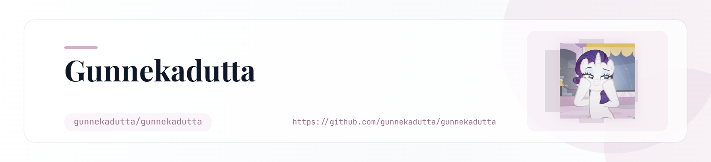

<picture>
   <source media="(prefers-color-scheme: dark)" srcset="art/header-dark.png">
   
</picture>

<picture>
  <source
    media="(prefers-color-scheme: dark)"
    srcset="https://capsule-render.vercel.app/api?type=waving&height=280&color=0:100A0F,20:1C0D18,45:EF93C4,70:FF69B4,100:F8BBD0&text=Gunneka%20Dutta&fontColor=ffffff&fontSize=58&fontAlignY=38&desc=engineering%20%7C%20ai%20%7C%20design%20%7C%20building&descAlignY=59&descSize=17&animation=fadeIn"
  />
  <source
    media="(prefers-color-scheme: light)"
    srcset="https://capsule-render.vercel.app/api?type=waving&height=280&color=0:F8BBD0,25:EF93C4,55:FF69B4,80:EF93C4,100:F8BBD0&text=Gunneka%20Dutta&fontColor=ffffff&fontSize=58&fontAlignY=38&desc=engineering%20%7C%20ai%20%7C%20design%20%7C%20building&descAlignY=59&descSize=17&animation=fadeIn"
  />
  
</picture>

<h1>
  Hey there, I'm <i>Gunneka</i> ♡
</h1>

 

&nbsp;

&nbsp;

 

<h2>୨୧ About Me ୨୧</h2>

<table align="center" width="90%">
<tr>

<td width="65%" valign="middle">

<h3><i>hello, world ♡</i></h3>

I'm <b>Gunneka</b> — a Mechanical Engineering student at
<b>IGDTUW</b>, currently exploring the softer and more creative side
of technology through <b>Machine Learning, UI/UX, AI, Data and Software</b>.

I love learning by building — taking an idea, experimenting with it,
breaking things along the way, and eventually turning it into something
that actually works.

 

<b>Currently</b> 
Mechanical Engineering @ IGDTUW

 

<b>Learning</b>
Machine Learning • UI/UX

 

<b>Building</b>
SaveIt

 

<b>Interested in</b>
AI • Data • Software • Automation

 

<b>Based in</b>
New Delhi

 

<b>Open to</b>
Collaborations • Projects • Opportunities

</td>

<td width="35%" align="center" valign="middle">

 

 

<i>currently somewhere between an idea & a finished project ♡</i>

</td>

</tr>
</table>

 

<h2>Tech Stack</h2>

  

 

<table align="center">
<tr>
<td align="center">
  <b>LANGUAGES</b> 
  Python • C • C++ • JavaScript
</td>

<td align="center">
  <b>DATA</b> 
  SQL • MySQL • NumPy
</td>
</tr>

<tr>
<td align="center">
  <b>WEB</b>
  HTML • CSS • JavaScript
</td>

<td align="center">
  <b>TOOLS</b>
  Git • GitHub • VS Code • Figma
</td>
</tr>
</table>

 

<h2> GitHub Analytics </h2>

  

 

<h2>Contribution Snake</h2>

<!--
GitHub Action:
Create .github/workflows/snake.yml

name: Generate Contribution Snake

on:
  schedule:
    - cron: "0 0 * * *"
  workflow_dispatch:

jobs:
  generate:
    runs-on: ubuntu-latest

    steps:
      - name: Generate Snake
        uses: Platane/snk@v3
        with:
          github_user_name: ${{ github.repository_owner }}
          outputs: |
            dist/github-contribution-grid-snake.svg?color_snake=ff69b4&color_dots=#161b22,#24101e,#6b304f,#c95d91,#ff69b4

      - name: Deploy Snake
        uses: crazy-max/ghaction-github-pages@v4
        with:
          build_dir: dist
        env:
          GITHUB_TOKEN: ${{ secrets.GITHUB_TOKEN }}
-->

  

<h2>୨୧ Let's Connect ୨୧</h2>

  

  

 

<code>♡ learn</code>
&nbsp;&nbsp;
<code>♡ create</code>
&nbsp;&nbsp;
<code>♡ experiment</code>
&nbsp;&nbsp;
<code>♡ repeat</code>

   

  <i>thanks for stopping by ♡</i>

 

